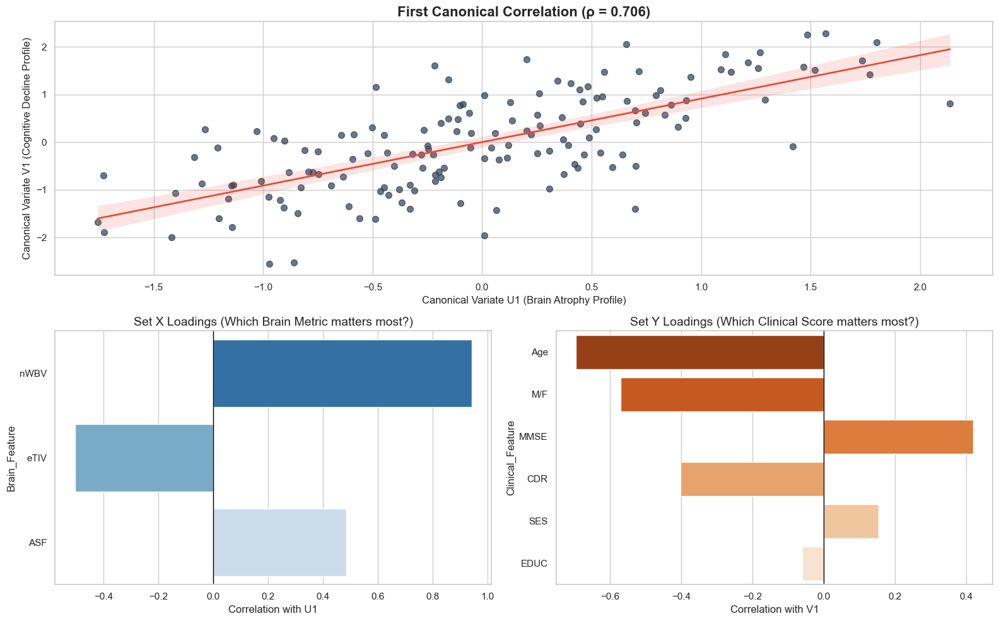

# 🧠 Alzheimer's Disease Brain Atrophy vs. Cognitive Decline (CCA Analysis)

## 📌 Overview
This project applies Canonical Correlation Analysis (CCA) to investigate the complex relationship between two distinct sets of variables in Alzheimer's patients

### 📊 Analysis Visualization
 

1. Physical Brain Metrics (Set X) Including Whole Brain Volume (nWBV) and Intracranial Volume (eTIV).
2. ClinicalCognitive Scores (Set Y) Including MMSE scores, Clinical Dementia Rating (CDR), and Education levels.

By using CCA, we identify how structural changes in the brain correlate with functional cognitive impairment, providing insights beyond simple pair-wise correlations.

## 📊 Key Findings
 Strong Canonical Correlation Identified a high correlation between brain volume reduction and cognitive performance drop.
 Dominant Features The Normalized Whole Brain Volume (nWBV) was found to be the strongest predictor of clinical status (CDR and MMSE).
 Demographic Impact Analysis shows how age and education level act as significant factors in the progression of the disease.

## 🛠️ Tech Stack
 Python (Pandas, NumPy)
 Statistical Modeling Scikit-Learn (`CCA`)
 Data Visualization Seaborn, Matplotlib
 Dataset OASIS-1 (Open Access Series of Imaging Studies)

## 📂 Project Structure
 `CCA.ipynb` Full analysis pipeline from data cleaning to CCA implementation.
 `data` (Optional) Link to the OASIS dataset or a processed version.
 `assets` Exported plots showing canonical loadings and correlations.

## 🚀 How to Run
1. Clone the repo.
2. Install dependencies `pip install pandas scikit-learn seaborn matplotlib`.
3. Run the Jupyter Notebook to see the step-by-step analysis.

## 🚀 Future Work & Research Directions
* **Deep Learning Integration:** Moving beyond numerical metrics by implementing **3D Convolutional Neural Networks (3D CNNs)** to analyze raw MRI volumetric data for automated feature extraction.
* **Longitudinal Analysis:** Incorporating multi-visit data (longitudinal studies) to model the progression of brain atrophy over time using Temporal CCA.
* **Multi-Modal Fusion:** Combining MRI data with genetic markers (like APOE-ε4) to see how genetic predisposition correlates with physical brain changes. 
